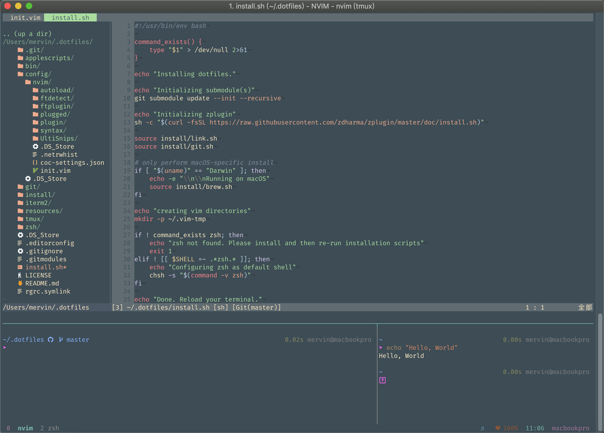

# Dotfiles

Welcome to my world. This is a collection of vim/nvim, tmux, and zsh configurations. 



## VIM
vim and neovim should just work once the correct plugins are installed. To install the plugins, you will need to open Neovim in the following way:

```bash
➜ nvim +PlugInstall
```

## Font

For free programming font, check out Mozilla's [Fira](http://mozilla.github.io/Fira/). In addition to this, I do have [nerd-fonts](https://github.com/ryanoasis/nerd-fonts) installed and configured to be used for non-ascii characters via iTerm2's profile settings. If you would prefer not to do this, then simply remove the `Plug 'ryanoasis/vim-devicons'` plugin from vim/nvim.
